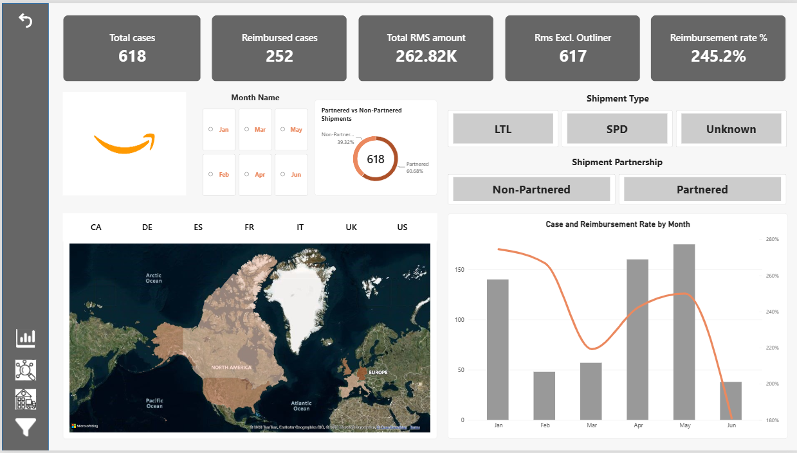
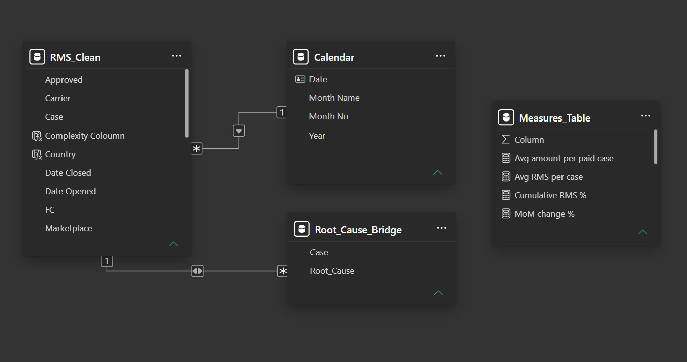
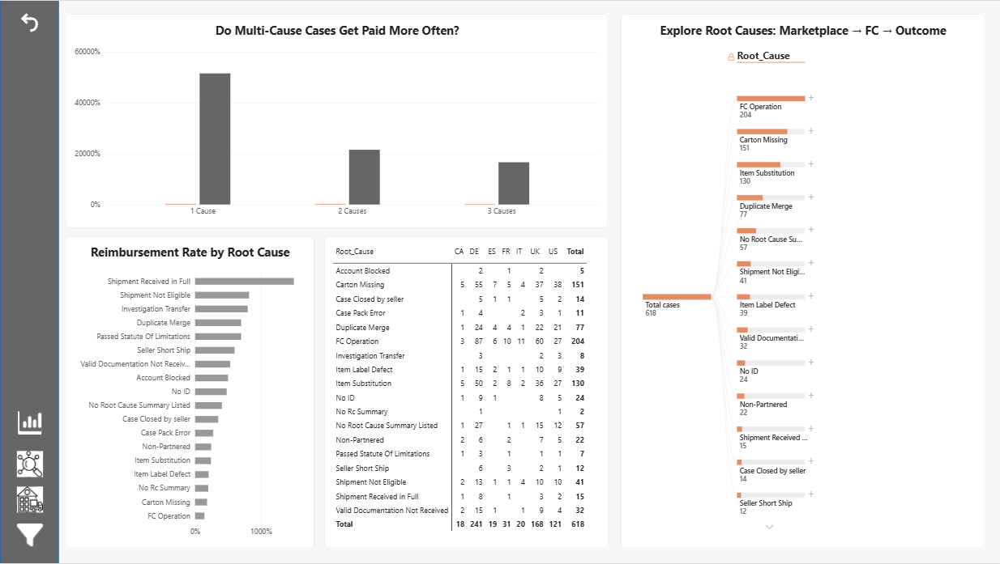
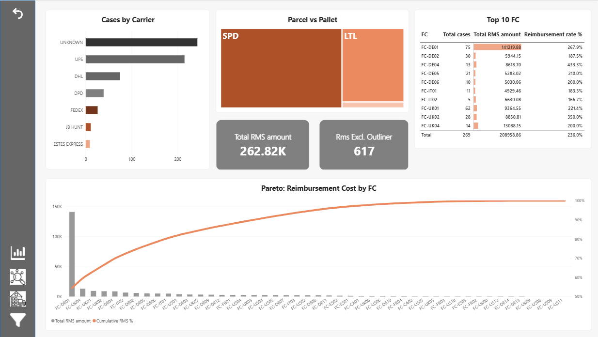

# Reimbursement Case Analytics | SQL · Power BI · Power Query

An end-to-end analytics project on **618 inbound shipment reimbursement investigation cases** (January–June 2025) across **7 marketplaces** and **47 fulfilment centres (FCs)**. The goal is to identify what drives reimbursement cost, which root causes are most common, and where process improvements would have the greatest impact.

The project is built on my experience as an Investigation Analyst, so the cleaning rules, business logic and recommendations reflect how this work happens in practice.



---

## Business Questions

1. How many cases were reimbursed, and how much was paid each month?
2. Which root causes drive the most cases, and which are most likely to be reimbursed?
3. Which FCs and marketplaces concentrate reimbursement cost?
4. Is cost concentrated in a few FCs (Pareto principle)?
5. How do partnered-carrier shipments compare with non-partnered shipments?

---

## Tools and Workflow

```
Excel (6 raw monthly sheets)
   → Power Query (data cleaning and transformation)
      → MySQL (analysis)
         → Power BI (data model, DAX, dashboard)
```

| Tool | Used for |
|---|---|
| Power Query | Combining sheets, cleaning, standardising, deduplicating |
| MySQL 8 | Data-quality checks and business analysis |
| Power BI | Data modelling, DAX measures, interactive dashboard |

---

## Data Cleaning (Power Query)

The raw file contained six monthly sheets with deliberate real-world data problems.

- **Combined 6 sheets** with inconsistent headers (trailing spaces, renamed columns) into one table
- **Removed 26 duplicate records** (22 exact duplicates and 4 cases re-logged in a later month), plus blank and total rows
- **Extracted case IDs** from case-tool URLs in the June sheet
- **Standardised data types:** dates stored in three text formats, amounts stored as text with currency symbols (€, £, $, C$), and the word "No" in numeric fields
- **Standardised text:** marketplace codes, Yes/No values, carrier name variants, and 17 root-cause categories with inconsistent spelling and separators
- **Rebuilt the Region field** from the marketplace code (EU / NA)
- **Derived a Shipment Partnership field:** a blank carrier means a non-partnered shipment (the seller's own carrier), and a named carrier means a partnered shipment. This rule comes from operational domain knowledge.
- **Kept 11 logically inconsistent records** (for example, closed before opened) and flagged them in SQL rather than guessing the correct values

**Result:** 618 clean, unique cases. The full cleaning script is in [`powerquery/cleaning_steps.m`](powerquery/cleaning_steps.m).

---

## SQL Analysis (MySQL)

| Script | Purpose |
|---|---|
| `01_setup.sql` | Database and table creation (DDL) |
| `02_bridge_table.sql` | Splits multi-value root causes into one row per cause using a **recursive CTE** |
| `03_data_quality.sql` | Duplicate, missing-value, logic and range checks |
| `04_kpis_trends.sql` | Headline KPIs, month-over-month trend, marketplace performance |
| `05_root_cause.sql` | Root-cause frequency, reimbursement rate, top cause per marketplace |
| `06_fc_carrier_seller.sql` | FC ranking, Pareto analysis, outlier detection, shipment type, carriers, sellers |
| `07_partnered_vs_non_partnered.sql` | Partnered vs non-partnered shipment comparison |

**Techniques used:** CTEs, recursive CTEs, window functions (`LAG`, `RANK`, `ROW_NUMBER`, running totals with `ROWS UNBOUNDED PRECEDING`), conditional aggregation, joins, `ALTER`/`UPDATE`, views, and statistical outlier detection (mean + 3 standard deviations).

---

## Power BI Dashboard

| Page | What it shows |
|---|---|
| **Executive Overview** | KPI cards, monthly trend, cases by country (map), partnered vs non-partnered split |
| **Root Cause Analysis** | Decomposition tree (root cause → marketplace → FC), reimbursement rate by cause, marketplace × root-cause heat map, resolution time |
| **FC & Operations** | Pareto chart of FC cost, top 10 FCs, parcel vs pallet comparison, partnered carriers |
| **Case Details** | Drill-through page with a dynamic title showing every case for the selected FC |

**Data model:** a star schema with a Calendar date table, the main case table and a root-cause bridge table (one-to-many, bi-directional filter).



**DAX highlights:**
- Time intelligence with `DATEADD` (month-over-month change)
- `CALCULATE` with filters (reimbursed cases, cost excluding the outlier)
- Running-total Pareto measure using `ALLSELECTED`
- Dynamic drill-through title using `SELECTEDVALUE`

| | |
|---|---|
|  |  |

---

## Key Insights

1. **One case distorts the overall picture.** A single non-partnered pallet (LTL) case at one FC (128,451; 412 ASINs) accounts for **49% of total reimbursement cost**. Total cost is 262,819 including it and 134,368 without it.
2. **Three root causes dominate.** FC Operation (204 cases), Carton Missing (151) and Item Substitution (130) are the most frequent. FC Operation cases are also the most likely to be reimbursed (**70.6%**).
3. **Cost is concentrated.** **10 of 47 FCs** account for about **80%** of reimbursement cost.
4. **Root causes differ by region.** FC Operation leads in most EU marketplaces, while Carton Missing leads in the US, Canada and Spain.
5. **Non-partnered pallets are harder to recover.** 39% of cases are non-partnered shipments. For LTL pallets, their reimbursement rate is **30.5%**, compared with **37.8%** for partnered shipments.
6. **Pallets are fewer but costlier.** LTL cases average 985 per case, compared with 173 for small parcels (SPD).

Full findings and recommendations are in [insights.md](insights.md).

---

## Recommendations

- Report cost **with and without outliers**, and route high-value cases to a secondary review
- Prioritise **FC process audits** at the highest-cost FCs, focusing on FC Operation errors
- Encourage sellers to use **partnered carriers for pallet shipments**, where tracking evidence most affects claim success
- Add **validation at case entry** to prevent date and status inconsistencies

---

## Limitations

- Amounts are in each marketplace's **local currency** (EUR, GBP, USD, CAD) and are not converted.
- 11 records contain logical inconsistencies, and 14 cases carry conflicting partnership signals (root cause vs carrier field). These were flagged, not corrected.
- The dataset is **synthetic and anonymised**. It is modelled on a real investigation workflow, but contains no real case, seller or FC data.

---

## Repository Structure

```
├── data/
│   ├── rms_cases_raw.xlsx          Raw data (6 monthly sheets)
│   └── rms_cases_clean.csv         Cleaned data used in MySQL
├── powerquery/
│   └── cleaning_steps.m            Full Power Query (M) cleaning script
├── sql/
│   └── 01_setup.sql … 07_partnered_vs_non_partnered.sql
├── powerbi/
│   ├── RMS_Case_Analytics.pbix     Power BI report
│   ├── dashboard.pdf               PDF export of all pages
│   └── dax_measures.md             All DAX measures with explanations
├── screenshots/                    Dashboard and data model images
├── insights.md                     Detailed findings and recommendations
└── README.md
```

---

## How to Reproduce

1. Open `data/rms_cases_raw.xlsx` in Power BI Desktop and apply the steps in `powerquery/cleaning_steps.m`, or open `powerbi/RMS_Case_Analytics.pbix` directly.
2. In MySQL 8+, run `sql/01_setup.sql`, import `data/rms_cases_clean.csv` into `rms_cases`, then run scripts `02` to `07` in order.

---

## Author

**Tanishka Gaur** · Investigation Analyst | PL-300 certified (Microsoft Power BI Data Analyst)
[LinkedIn](https://www.linkedin.com/in/your-profile) · [Email](mailto:your.email@example.com)
